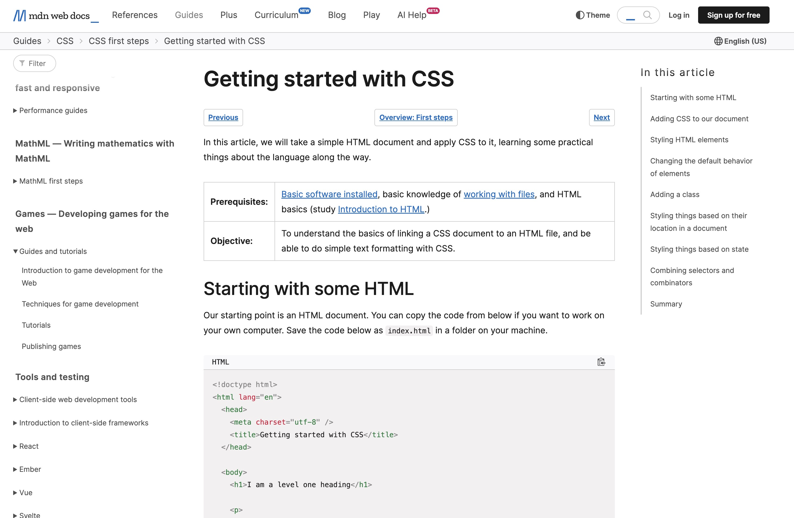
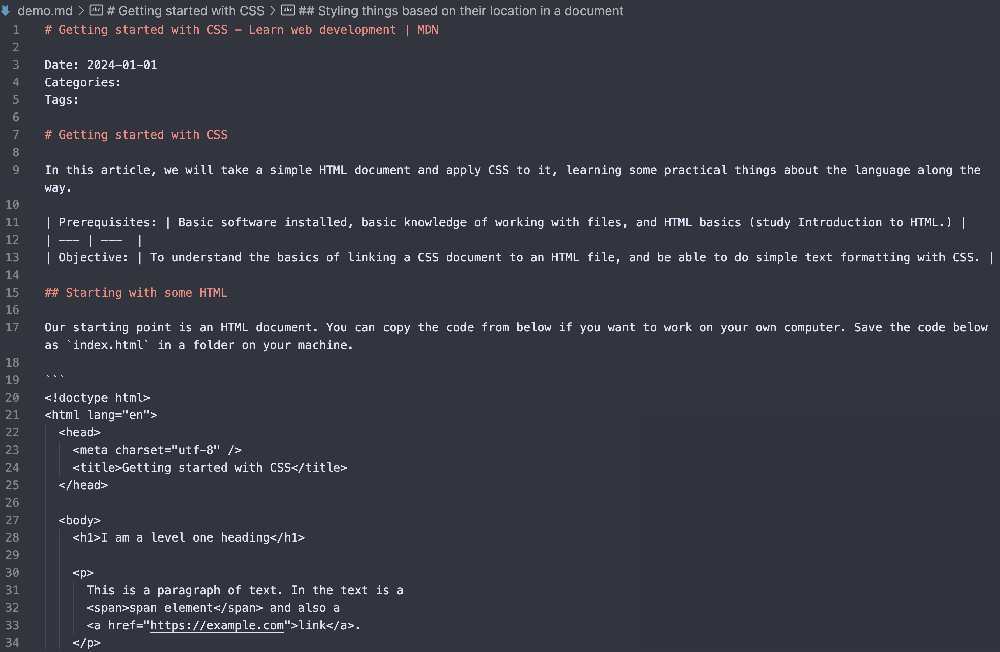

# Code-Friendly HTML to Markdown Converter

When preparing [StarCoder2](https://huggingface.co/bigcode/starcoder2-15b) document data, we found that the existing library is not very friendly to code blocks, especially on the indentation (e.g., they often drop the indentation). Therefore, I developed this lightweight script to convert HTML to Markdown, which can better handle code blocks.

## Features

- Lightweight script with minimal dependencies
- Converts HTML content to Markdown format
- Preserves code blocks and their formatting
- Handles inline code and code blocks
- Provides command-line interface for easy usage

## Installation

To use this script, you'll need to have Python 3 installed on your system. The only dependency is the `trafilatura` library, which can be installed using `pip`:

```bash
pip install trafilatura
```
> Note: we test the script under 1.8.1 version of `trafilatura`.

## Usage

You can use the script from the command line by providing the HTML content as input. For example:

```bash
python main.py --input demo.html --output demo.md
```

This will read the content of `demo.html` (from [MDN Web Docs](https://developer.mozilla.org/en-US/docs/Learn/CSS/First_steps/Getting_started)), convert it to Markdown format, and save the result to `demo.md`.

## Example

Here is a comparison of the input HTML content and the output Markdown content:

### Original HTML



### Markdown



## Acknowledgement

This script is inspired by the awesome [trafilatura](https://github.com/adbar/trafilatura) library, which is used for extracting relevant content from HTML pages. I highly recommend checking it out if you need to extract text from web pages.